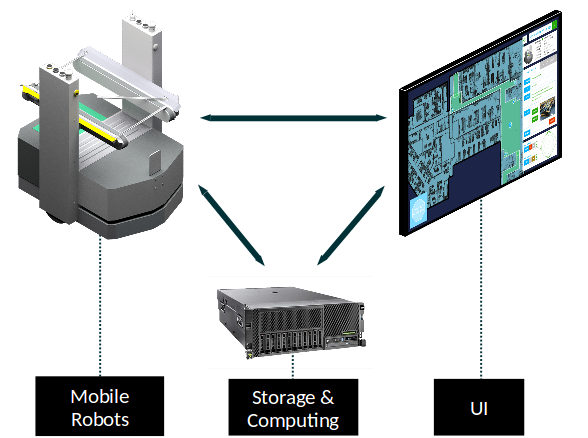

Architecture
======================

Intellos architecture consists comprises the algorithms executed on a remote server (Intello Server) and the web-based UI.
Connecting your robot via standard ROS topics to the stack, enables your robot to create maps, navigate around (dynamic) obstacles, process orders and to annotate the map with points of interest, prohibited areas etc.
The provided UI can be opened by any browser-enabled device such as Tablet or desktop computer. Even Mac.

