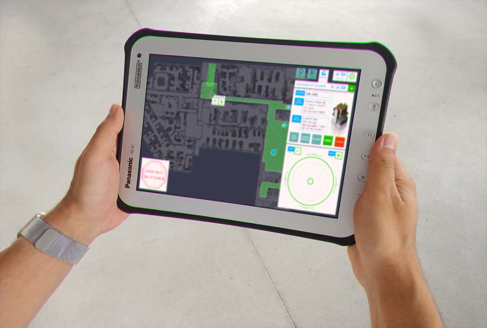

.. intello documentation master file, created by
   sphinx-quickstart on Sun Sep  2 22:19:06 2018.
   You can adapt this file completely to your liking, but it should at least
   contain the root `toctree` directive.

.. See example of cartographer https://raw.githubusercontent.com/googlecartographer/cartographer_ros/master/docs/source/index.rst

.. See syntax: http://www.sphinx-doc.org/en/master/usage/restructuredtext/basics.html

.. Or cheat sheet here: http://openalea.gforge.inria.fr/doc/openalea/doc/_build/html/source/sphinx/rest_syntax.html

Welcome to **Intello** by Gestalt Robotics
===========================================

.. toctree::
   :maxdepth: 2

   architecture
   quick
   usage
   debugging
   simulation

**Intello** is an intelligence stack for mobile transport robots. Extend your hardware platform with an optimized ROS-based architecture for autonomous navigation and user-oriented control. You will just need to connect your mobile platform to the available Intello stack in the cloud in order to provide full value autonomous capabilities with your robot hardware.
The Intello stack includes:

* **Web-based user interface**. Makes it possible to define points of interest on a map, to create jobs by targeting multiple POIs in a row and to directly control the robot via a fancy remote controller.

* **SLAM** - Simultaneous localization and mapping using scanner data to build a map and also to localize the robot on a previously created map.

* **Path planner**. Enables to robot to avoid obstacles and to drive besides them.

* **Configuration**. Pass configuration of your robot or application specific parameters such as maximum drive speed or maximum range scanner distance.

