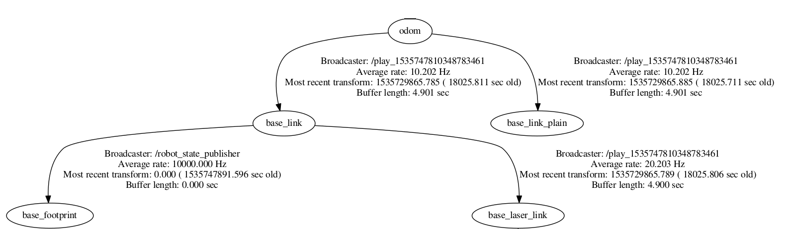

Quick setup
############################

Network setup
=================

Prepare your robot for ROS. Make sure it connects via a tunnel to the master server, publishes the laser scan, odometry and the required transforms (`TFs <http://wiki.ros.org/tf>`_). The following instructions assume you are under Ubuntu 16.04 LTS or newer.
You will need a dedicated machine (the master) available. To get one, please contact Gestalt Robotics.
The connection is established by a vpn tunnel to your dedicated instance in the cloud. 

Make sure you have the required credentials in place and setup your network configuration automatically by just one command line:

.. code-block:: Bash
    
    sudo bash -c "$(curl -L https://raw.githubusercontent.com/GESTALT-Robotics/avs_doc/master/scripts/network_setup.sh)"

If everything went fine, you will be able to ping ``10.0.0.100`` after you have called ``start_intello_tunnel``:

.. code-block:: python

    start_intello_tunnel
    #test:
    ping 10.0.0.100

ROS setup
==============

Tell ROS about the network configuration and add these lines to ``~/.bashrc``:

.. code-block:: python

    export ROS_MASTER_URI=http://ros_master:11311
    export ROS_IP=10.0.0.200
    export ROS_HOSTNAME=robot

Verify and make sure you see the ``/rosout`` topic on the robot machine:

.. code-block:: python
    
    rostopic list

Published information
-------------------------

Start your ros nodes on the robot.
Verify, that you publish  following topics:

* /scan of Type ``sensor_msgs/LaserScan``. Verify this by calling ``rostopic info /scan``

* /odom of type ``nav_msgs/Odometry`` The topic must contain the pose computed from the wheel encoders. The covariance is optional. Verify this by calling ``rostopic info /odom``. Though, it is important, that the TF frame is set to ``odom``.

* TF: Make sure, your ``robot_state_publisher`` publishes the TFs for the frames ``base_link`` in ``odom``, ``base_laser_link`` in ``base_link`` and ``base_footprint`` in ``base_link``.

Verify your TFs by calling ``rosrun tf view_frames`` and then ``evince frames.pdf`` (or any other PDF viewer to see the generated frames.pdf file).

