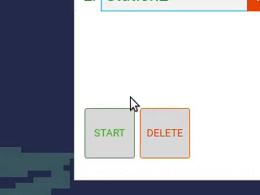

How to use
#################

Open the Web-Based User Interface
------------------------------------

Simply open 

.. code-block:: Bash

	<ip_of_your_server>:5000

in the browser:

.. image:: _static/images/overview.png

Driving the robot
-----------------------

In order to drive the robot directly via remote control, simply drag the controller to the top to drive forward etc.

.. image:: _static/images/usage/nipple.gif

Calling AGV to a position on map
---------------------------------

* Click on the map
* Select "Call AGV" button
* Adjust the orientation of the robot by dragging the outer circle

.. image:: _static/images/usage/call_agv.gif

Create a new Point of Interest (POI)
--------------------------------------

* Click on the map
* Select "Create"
* Adjust the orientation of the robot at the POI
* Set the name and description
* Decide whether it is a charging station or a normal work position
* Click "save"

Add a POI to a mission
----------------------------
A mission is a collection of multiple targets (POIs) the robot needs to approach. A simple case would be to send the robot between POI-A and POI-B in a loop for a demo case. 

You can add as many POIs to a mission as you like.

Create a mission with the first POI
^^^^^^^^^^^^^^^^^^^^^^^^^^^^^^^^^^^^^

* Click on an existing POI
* Select "Mission"
* Select "Create mission"
* Enter the name of the mission
* Click OK.

.. image:: _static/images/usage/new_mission.gif

Add a POI to mission
^^^^^^^^^^^^^^^^^^^^^^^^^^^^^^^^^^^^^

* Click on an existing POI
* Select "Mission"
* Select "Append to mission"
* Select a mission and press OK

Start a Mission
--------------------
When you are read to drive the robot between POIs, you can start the mission.
You can decide whether you want to drive the POIs in loop or to target the list of POIs only once.

* Select a mission from the list inside the mission editor
* If needed, you may reorder the POIs on the list
* Select between driving once or driving in loop via the toggle button on the right
* Press "Start"

