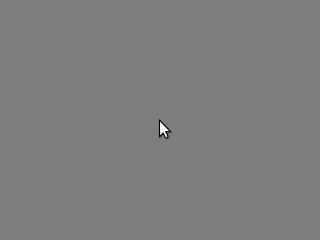

How to use
#################

Opening the UI
---------------------

Simply open 

.. code-block:: Bash

	<ip_of_your_server>:5000

in the browser:

Driving the robot
-----------------------

In order to drive the robot directly via remote control, simply drag the controller to the top to drive forward etc.

Calling AGV to a position on map
---------------------------------

* Click on the map
* Select "Call AGV" button
* Adjust the orientation of the robot by dragging the outer circle

Create a new Point of Interest (POI)
--------------------------------------

* Click on the map
* Select "Create"
* Adjust the orientation of the robot at the POI
* Set the name and description
* Decide whether it is a charging station or a normal work position
* Click "save"

.. image:: _static/images/usage/new_poi.gif

More to come...